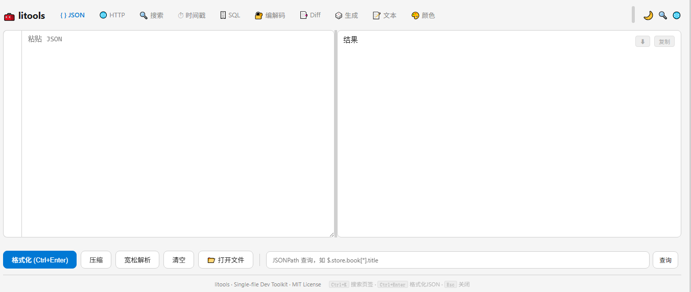

<p align="center">
  
</p>

<h1 align="center">litools</h1>

<p align="center">
  <strong>Li's Dev Toolkit — 单文件开发者工具箱</strong><br>
  一个 HTML 文件，零依赖，双击即用
</p>

<p align="center">
  
  
  
  
</p>

---

## 功能一览

| 模块 | 功能 |
|------|------|
| **{ } JSON** | 格式化 / 压缩 / 转义 / 树形展示（结果区搜索 + 命中导航）/ JSONPath 查询 / 智能修复（转义、toString、单引号等自动纠正）/ 键排序 / 保留转义 / 节点统计 / 粘贴即格式化 |
| **🔍 搜索** | 多关键词高亮 / 命中计数与上下导航 / 替换 / 过滤 / 流式搜索大文件（50MB+） |
| **◎ 正则** | 正则测试（行号 + 实时高亮）/ 正则解释 / 常用正则速查 |
| **⏱ 时间戳** | 秒/毫秒/微秒互转（自动识别）/ 相对时间 / 计时器 |
| **🗄️ SQL** | IN 语句生成 / INSERT 解析（列值对应，支持转义与批量）/ SQL 格式化 |
| **🔐 编解码** | Base64 / URL / HTML 实体 / JWT 解码 |
| **📑 Diff** | 文本差异对比 / 交换 / 高亮显示 |
| **🎲 生成** | UUID（多种格式） / Hash（SHA-1/256/384/512） |
| **📝 文本** | 排序 / 去重 / 反转 / 大小写 / 统计 / CSV 解析 / Diff |
| **🎨 颜色** | HEX / RGB / HSL 互转 / 调色板预览 |
| **🔢 进制** | 十进制 / 十六进制 / 二进制 / 八进制互转 |
| **📋 CSV** | CSV 解析 / 自动检测分隔符 / 表格预览 |

## 特性

- **单文件** — 整个工具就是一个 `index.html`，无需安装、无需 Node.js、完全离线可用
- **零依赖** — 纯原生 HTML + CSS + JavaScript，无任何第三方库
- **中英双语** — 右上角一键切换，UI 实时跟随
- **暗色主题** — 支持亮色 / 暗色主题切换
- **大文件支持** — 搜索模块支持 50MB+ 文件的流式搜索
- **快捷键** — `Ctrl+K` 搜索页签，`Ctrl+Enter` 格式化 JSON
- **拖拽支持** — 直接拖文件到对应模块即可打开

## 快速开始

```bash
# 方式一：直接下载
# 下载 index.html，双击用浏览器打开

# 方式二：GitHub Pages（推荐）
# Fork 后在 Settings → Pages 启用即可
```

## 快捷键

| 快捷键 | 功能 |
|--------|------|
| `Ctrl + K` | 搜索页签 |
| `Ctrl + Enter` | 格式化 JSON |
| `Escape` | 关闭弹窗 |

## 技术栈

- HTML5 + CSS3 + Vanilla JavaScript
- `crypto.subtle`（Hash 计算，需 HTTPS 或 localhost）
- Web APIs: `FileReader`, `TextEncoder`, `navigator.clipboard`

## 浏览器兼容

| 浏览器 | 版本 |
|--------|------|
| Chrome / Edge | 90+ |
| Firefox | 90+ |
| Safari | 15+ |

## License

[MIT](LICENSE)
